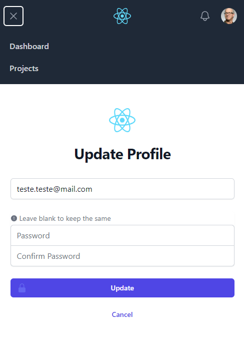
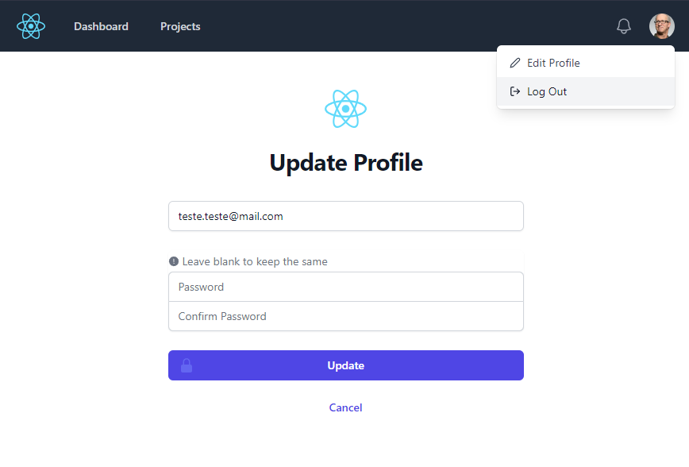

# ReactJS + Vite + TailwindCSS + Firebase auth

This is a good starting point for your next project that needs firebase auth

<div style="display:flex;">



</div>

# Setup

- Clone the project with 
```
git clone https://github.com/IgorBayerl/react-vite-tailwind-firebase-auth-template.git
```
- Navigate to the directory
```
cd react-vite-tailwind-firebase-auth-template
```
- Install the dependencies with
```
yarn
```
- Configure the .env file with your firebase credentials
- run with
```
yarn dev
```
